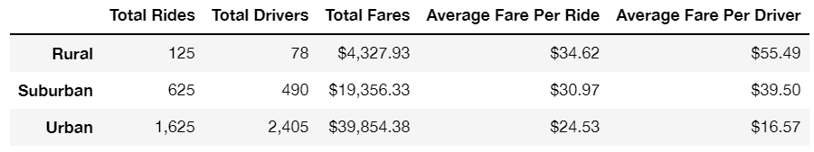
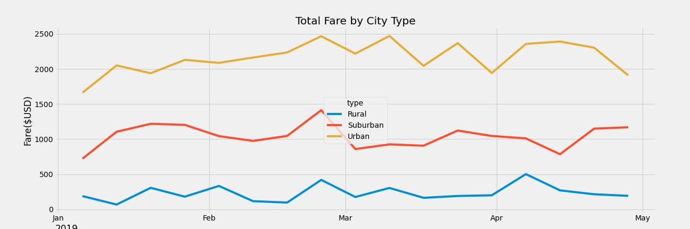

# PyBer Analysis

## Overview of the analysis
In the first phase of the project, the objective was to analyze the ridesharing city behavior from datasets of the company PyBer. At the end of the project, the requirement is to calculate metrics related to the total weekly fares for each city type where this company operates.

In this last sprint, we created a new data frame to find the average fare per week from January 1st, 2019 to April 28th, 2019 for each city type. The data frame from the analysis was used to create a multiple-line graph that showcases the total weekly fares per city type into that period. This analysis could help PyBer CEO to address any disparities among the city types.

## Results
The ridesharing summary by city type showcases the comparison of PyBer services in three city types: rural, suburban, and urban. The users' demand in urban cities is more than in suburban and rural. There are 1,625 total rides in urban, 625 rides in suburban, and 125 rides in rural.

As we can see, users from rural cities pay on average almost $10 more than users in urban cities and $6.44 more than users in suburban cities. It could be related by the number of total drivers and rides per city type, for instance, the total rides in rural cities are almost double available drivers while the total rides are almost two-third of total available drivers in urban cities. However, due to the total rides per city type, the total fares in rural cities is almost 10% of the total fares of the urban cities and almost 22% of total fares of suburban cities. 

As a result, the average fare per driver in urban cities is $16.57, $55.49 in rural, and $39.50 in suburban. So it could be necessary to increase the number of drivers in suburban and rural cities to balance the average fare per driver. These results could indicate a low quality of service in rural and suburban cities due to the availability of drivers.

